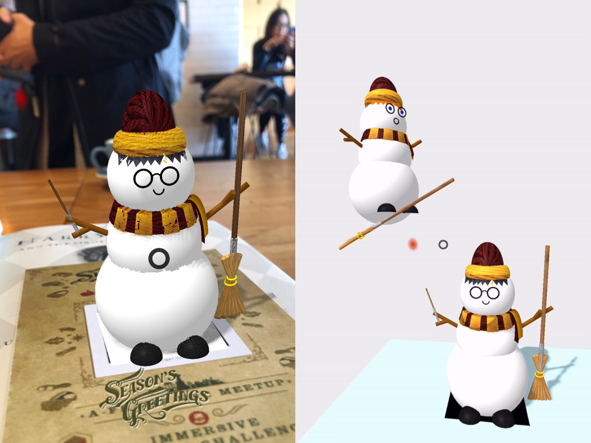

# Snowy Potter - Augmented Reality Holiday Card

  

#### To view Snowy Potter in Glitch:
**[View Snowy Potter](https://mysnowman.glitch.me/?)**
#### To view a video of the Augmented Snowy Potter appearing over a QR code:
**[View Snowy Potter Video](https://saharafathelbab.github.io/Snowy-Potter/HarryPotterInfo.html?)**

#### General Information

This project was created as part of a Holiday Challenge with the meetup group A-Frame NYC.

#### Technologies Used

* Glitch
* A-Frame Library

#### What as the aim for this project?

My aim was to create a snowman, by using A-Frame, that resembled Harry Potter. Once completed, he would appear on a QR code when a phone hovered over it. I then gifted the QR code to a friend for the Holidays.

#### How was the QR code gifted?

I decided to make a physical Virtual Reality world and then placed the QR code in the center of it; in essence I wanted the Snowy Potter to be in a setting he belonged in.

#### How was the physical virtual world created?

I used 4 rectangular panels of cardboard - one for the ground and three were to make up the forest. In order to ensure when sent in the mail to my friend that they would be able to assemble it properly, I attached lego blocks at the bottom of each panel. An identical lego block for each of the 3 forest panels were placed on the ground panel.

  

After attaching each forest panel with its identical lego on the ground panel, on the ground panel there was the QR code. My friend would hover her phone over it and then Snowy Potter would appear with background music inisde the Physical Virtual Reality world:

  

#### Will you be making other Virtual Reality snowmen?

At the moment I have made Snowy Potter and Snowy Ron - Snowy Hermione is currently being made as well. Over on my **[blog](http://saharasdreams.com/2018/12/thinking-outside-box.html)** , I thought it would be fun - and also allow me to become more comfortable with Virtual Reality - to have my readers suggest their favorite fictional character to be made into a Virtual Reality Snowman.

Below is Snowy Potter and Snowy Ron:

  

#### How do you personally currently use the Snowy Potter QR code?

At the moment, I have the QR pasted onto a thick paper which I use as a bookmark as I read.
